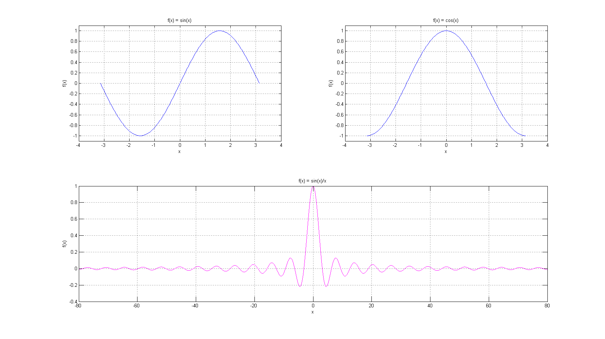

# Matlab 学习笔记
> 都毕业了又学学Matlab，纯粹为了好玩。

## 正余弦函数

```matlab
x = -pi:pi/100:pi;

y1 = sin(x);
subplot(2,2,1);
plot(x,y1);
axis([-4, 4, -1.1, 1.1]);  
xlabel('x');
ylabel('f(x)');
title('f(x) = sin(x)');
grid on;

y2 = cos(x);
subplot(2,2,2);
plot(x,y2);
axis([-4, 4, -1.1, 1.1]);
xlabel('x');
ylabel('f(x)');
title('f(x) = cos(x)');
grid on;

x1 = -80:0.01:80;
y3 = sin(x1)./x1;
subplot(2,1,2);
plot(x1,y3,'m'); 
xlabel('x');
ylabel('f(x)');
title('f(x) = sin(x)/x');
grid on;
```

